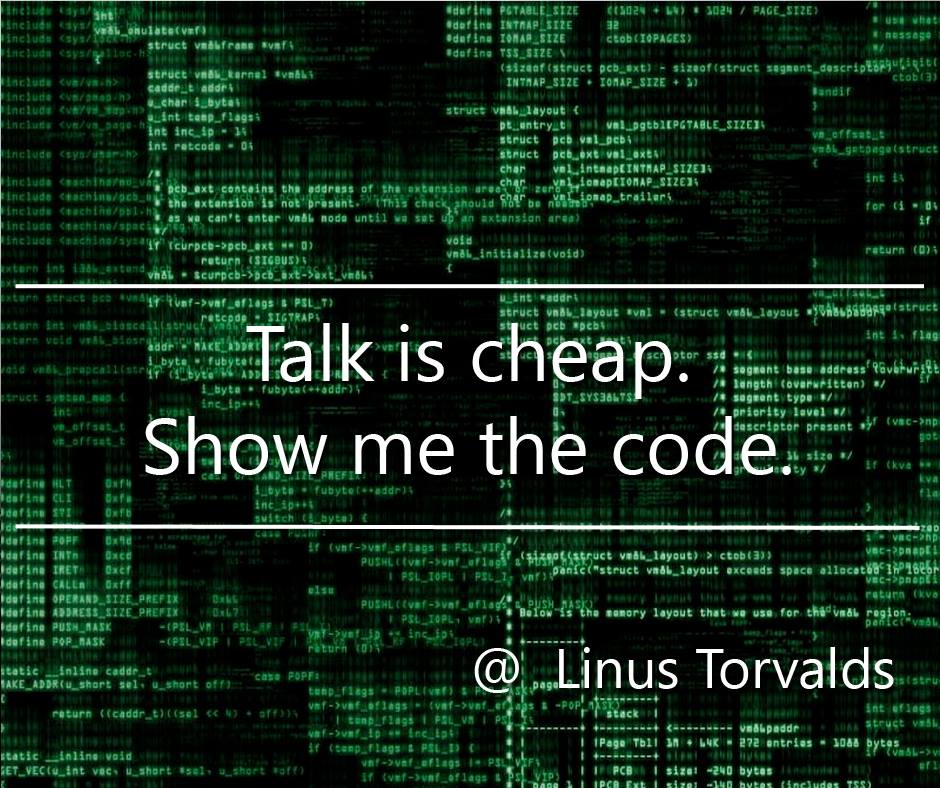

--- 

<section>

---

## 汉云投资 2020 年会

---

## 团圆会

</section>

 

[方 莲](https://williamlfang.github.io/) 

*** =pnotes

开始暖场

---

.fragment 每次年会，我都会好好准备

.fragment 成为了我的一道阅兵式

.fragment 总结过去的经验，规划未来的战略，间或调侃一下自己

---
 
## 变化与不变

<section>

---

友：你变了

---

我：变秃了

---
友：不，你变老了

--- 

---

「金融狗」

---
「程序猿」

</section>

---

--- &vertical

## 知乎

> 「代码写多了容易少什么？」

*** ds:blackout

相信大家的第一反应是...

.fragment ... 「少头发」 ...

> - 好嗨哟
> - 都还在

*** ds:indigo

但是，我觉得还有一样东西也是越来越少。

.fragment 

*** ds:indigo

.fragment 这句话应该如何翻译呢？

> - 废话少说，放「码」过来
> - 瞅啥瞅，快滚去写代「码」

 

.fragment 所以，尴尬就来了？

> - 如果我继续说，那我一定不是一个合格的码农
> - 如果我不说，则无法证明自己就是那个码农

--- ds:brown &vertical

## 感谢的话

*** ds:pink
# 感谢你
.fragment 小伙伴们

*** ds:blackout
## 数字的话

*** ds:blackout
## 3

*** ds:blackout
## 2

*** ds:blackout
## 1

*** ds

## 3年工作，5年的开发经验

.fragment 我来汉云刚好是3整年，写了点代码，做了点事情。

> - 一套程序化交易系统
> - 一些爬坑的经验
> - 一门需要实时更新的手艺

*** ds
## 积累经验，仍需继续前进

.fragment 昨日不可追，我们只有向前，才能保持不后退 

.fragment 量化市场就像当年的美苏争霸时期，只有让自己变得强大  

.fragment 才能不被打垮

> - 技术上继续精进
> - 设备上需要投入

*** ds
## 数据+策略+交易

> - 自建数据库：期货+股票
> - 多市场+多品种+多周期
> - 优化算法

*** ds:blue

## 20:新时代，新生代

.fragment 我们告别了一个时代，我们也迎来了一个时代。

> - 监管逐步放开交易限制
> - 资金逐步促使优胜劣汰
> - 量化逐步成为投资主流

*** ds:blue

## 期货+股票
.fragment 我们在期货、股票市场均有布局

.fragment 我们也希望能够实现两条腿并行前进

*** ds:yello

## 专注

*** 

.fragment 胸有大志，脚踏实地

